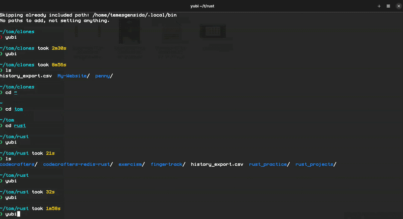
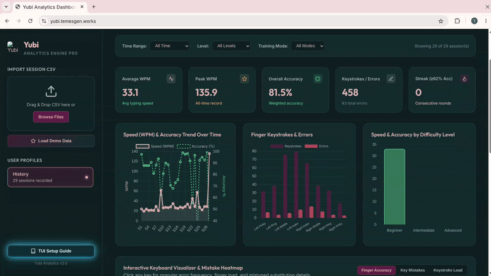

  

<h1 align="center">Yubi</h1>

  Yubi is an interactive terminal typing trainer designed to analyze physical finger movements and pinpoint key substitution errors with high precision. It features terminal analytics with smoothed accuracy trend curves, per-finger performance heatmaps, and local progress tracking. Coupled with a web-based visualizer dashboard, Yubi seamlessly transforms terminal typing data into interactive charts and deep behavioral insights.

  🌐 <b>Live Web Visualizer:</b> <a href="https://yubi.temesgen.works">https://yubi.temesgen.works</a>

---

## 📺 Demos & Previews

### 1. Terminal Typing Trainer (TUI)

### 2. Web Analytics Visualizer

